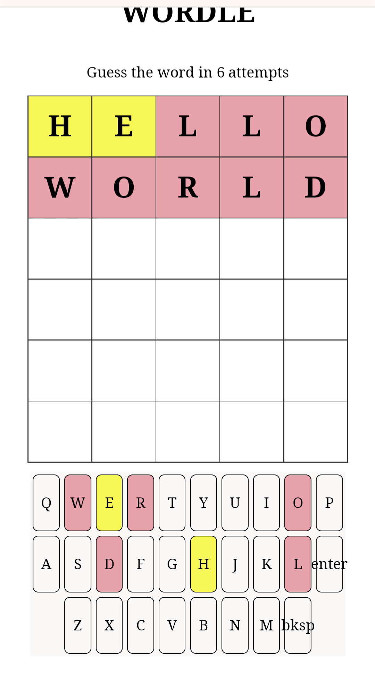

# Wordle
## Live Site: https://neon-salmiakki-b78805.netlify.app/

This app is a clone of the popular game Wordle.

## Setup

1. Clone the project:
   git clone [https://github.com/ivannissimrch/wordle.git]
2. Install dependencies:
   cd wordle
   npm install
3. Run game:
   npm run dev and open your browser on [http://localhost:5173/]

## Components:

1. App.js is the Main component where most of the logic is implemented
2. WordsGrid.js is a component that displays a grid with all the words that the user enters.
3. KeyBoard.js is an onscreen keyboard that when clicked in updates the grid with the letter entered.

when the program starts generating a random 5-letter target word
when the user clicks the enter key handleSubmitword validates the input and updates the grid with different colors to give the user feedback about the letters entered.

keyboard keys are also styled
